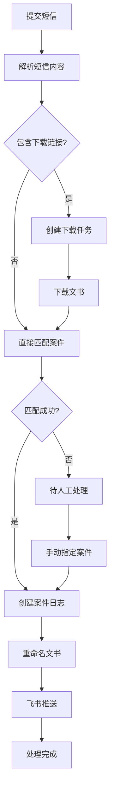

# 🤖 自动化工具模块

提供文档处理、语音转文字、网络爬虫等自动化功能。

## 📚 文档

### 核心功能文档

- **[法院文书下载优化](../../docs/guides/COURT_DOCUMENT_DOWNLOAD_GUIDE.md)** - 完整的使用指南 ⭐
  - API 拦截方式下载文书
  - 自动保存文书元数据
  - Django Admin 管理界面
  - 配置说明和最佳实践

### 其他文档

所有文档都在 **[docs/](docs/)** 目录：

- **[docs/README.md](docs/README.md)** - 完整的模块文档
- **[docs/QUICKSTART.md](docs/QUICKSTART.md)** - 快速开始（5分钟）
- **[docs/COURT_DOCUMENT_GUIDE.md](docs/COURT_DOCUMENT_GUIDE.md)** - 文书下载指南
- **[docs/STRUCTURE.md](docs/STRUCTURE.md)** - 目录结构说明
- **[docs/INDEX.md](docs/INDEX.md)** - 文档索引

## 🧪 测试

所有测试都在 **[tests/](tests/)** 目录：

- **[tests/test_court_document.py](tests/test_court_document.py)** - 文书下载测试
- **[tests/debug_page_structure.py](tests/debug_page_structure.py)** - 页面调试工具

## 🚀 快速开始

```bash
# 1. 查看文档
cat docs/QUICKSTART.md

# 2. 运行测试
python tests/test_court_document.py

# 3. 访问 Admin
open http://localhost:8000/admin/automation/
```

## 📁 目录结构

```
automation/
├── docs/          # 📚 所有文档
├── tests/         # 🧪 所有测试
├── admin/         # Django Admin
├── api/           # API 接口
├── services/      # 业务逻辑
│   └── scrapers/  # 爬虫模块
├── models.py      # 数据模型
└── tasks.py       # 后台任务
```

详见：**[docs/STRUCTURE.md](docs/STRUCTURE.md)**


## 🔄 迁移指南

### 新架构组件

本模块已进行解耦重构，引入以下新组件：

1. **BrowserManager** - 统一浏览器管理
2. **BrowserConfig** - 集中配置管理
3. **CaptchaRecognizer** - 可插拔验证码识别
4. **依赖注入** - 提高可测试性

### 迁移步骤

#### 1. 使用 BrowserManager

**之前：**
```python
from playwright.sync_api import sync_playwright

with sync_playwright() as p:
    browser = p.chromium.launch(headless=False, slow_mo=500)
    context = browser.new_context(...)
    page = context.new_page()
    # 使用浏览器
    browser.close()
```

**之后：**
```python
from apps.automation.services.scraper.core.browser_manager import BrowserManager
from apps.automation.services.scraper.config.browser_config import BrowserConfig

config = BrowserConfig.from_env()
with BrowserManager.create_browser(config) as (page, context):
    # 使用浏览器
    # 自动清理
```

#### 2. 使用依赖注入

**之前：**
```python
service = CourtZxfwService(page, context)
```

**之后：**
```python
from apps.automation.services.scraper.core.captcha_recognizer import DdddocrRecognizer

# 可选：注入自定义识别器
recognizer = DdddocrRecognizer()
service = CourtZxfwService(
    page,
    context,
    captcha_recognizer=recognizer
)
```

#### 3. 配置管理

创建 `.env` 文件或设置环境变量：

```bash
# 浏览器配置
BROWSER_HEADLESS=false
BROWSER_SLOW_MO=500
BROWSER_VIEWPORT_WIDTH=1280
BROWSER_VIEWPORT_HEIGHT=800
BROWSER_TIMEOUT=30000
```

### 详细指南

- **[docs/BROWSER_MANAGER_GUIDE.md](docs/BROWSER_MANAGER_GUIDE.md)** - BrowserManager 使用指南
- **[docs/CAPTCHA_RECOGNIZER_GUIDE.md](docs/CAPTCHA_RECOGNIZER_GUIDE.md)** - CaptchaRecognizer 扩展指南

## 🎯 新特性

- ✅ 统一的浏览器生命周期管理
- ✅ 环境变量配置支持
- ✅ 可插拔的验证码识别
- ✅ 自动 Cookie 管理
- ✅ 完整的错误处理
- ✅ 依赖注入支持
- ✅ **财产保全担保费询价功能** - 自动查询所有保险公司报价

## 💰 财产保全担保费询价

### 功能概述

自动查询财产保全担保费，支持并发查询多个保险公司，提供 Admin 后台和 RESTful API 两种访问方式。

### 核心特性

- **自动任务提交**: 创建任务后自动提交到 Django Q 队列执行 ✨
- **自动 Token 管理**: 复用现有 Token，避免重复登录
- **异步并发查询**: 使用 httpx + asyncio 并发查询所有保险公司
- **双重访问方式**: Django Admin 后台 + RESTful API
- **完整数据追溯**: 持久化所有询价记录和报价结果
- **优雅错误处理**: 单个保险公司查询失败不影响其他查询
- **高性能**: 10 个保险公司的查询通常在 3-10 秒内完成

### 快速开始

#### 1. Admin 后台使用

```bash
# 访问 Admin 后台
open http://localhost:8000/admin/automation/preservationquote/

# 1. 创建询价任务
# 2. 任务自动提交到队列并执行 ✨
# 3. 查看报价结果
```

**注意**: 创建任务后会自动提交到 Django Q 队列执行，无需手动点击"立即运行"按钮。

#### 2. API 使用

```python
import requests

BASE_URL = "http://localhost:8000/api/v1/preservation-quotes"
headers = {"Authorization": "Bearer <your_jwt_token>"}

# 创建询价任务
response = requests.post(BASE_URL, json={
    "preserve_amount": 100000.00,
    "corp_id": "440300",
    "category_id": "1",
    "credential_id": 1
}, headers=headers)

quote_id = response.json()["data"]["id"]

# 执行询价任务
response = requests.post(f"{BASE_URL}/{quote_id}/execute", headers=headers)

# 获取报价结果
response = requests.get(f"{BASE_URL}/{quote_id}", headers=headers)
quotes = response.json()["data"]["quotes"]

for quote in quotes:
    print(f"{quote['company_name']}: ¥{quote['premium']}")
```

#### 3. Service 层使用

```python
from decimal import Decimal
from apps.automation.services.insurance.preservation_quote_service import PreservationQuoteService
import asyncio

service = PreservationQuoteService()

# 创建询价任务
quote = service.create_quote(
    preserve_amount=Decimal("100000.00"),
    corp_id="440300",
    category_id="1",
    credential_id=1
)

# 执行询价任务
async def execute():
    result = await service.execute_quote(quote.id)
    print(f"查询完成: {result['success_count']}/{result['total_companies']}")

asyncio.run(execute())
```

### 文档

- **[services/insurance/AUTO_SUBMIT_GUIDE.md](services/insurance/AUTO_SUBMIT_GUIDE.md)** - 自动提交功能指南 ✨
- **[services/insurance/API_USAGE_GUIDE.md](services/insurance/API_USAGE_GUIDE.md)** - API 使用指南
- **[services/insurance/ADMIN_USAGE_GUIDE.md](services/insurance/ADMIN_USAGE_GUIDE.md)** - Admin 后台使用指南
- **[services/insurance/CODE_EXAMPLES.md](services/insurance/CODE_EXAMPLES.md)** - 代码使用示例
- **[tests/PERFORMANCE_TEST_RESULTS.md](tests/PERFORMANCE_TEST_RESULTS.md)** - 性能测试结果

### 性能指标

- ✅ **并发查询**: 10 个保险公司 < 10 秒（实际 ~3 秒）
- ✅ **Token 复用**: 避免重复登录，提升性能
- ✅ **数据库查询**: < 0.01 秒（使用索引优化）
- ✅ **连接池复用**: HTTP 连接复用，减少开销

### 技术栈

- Django 5.2+
- django-ninja 1.3+ (RESTful API)
- httpx (异步 HTTP 客户端)
- Pydantic 2.0+ (数据验证)
- Hypothesis (属性测试)
- pytest (测试框架)

## 🔍 验证码识别 API

### 功能概述

提供验证码识别服务的 RESTful API，支持前端 JavaScript 直接调用。基于 ddddocr 库实现，支持多种图片格式，提供统一的 JSON 响应格式。

### 核心特性

- **Base64 图片上传**: 支持 Base64 编码的图片数据，兼容 data URL 格式
- **多格式支持**: PNG、JPEG、GIF、BMP 格式
- **统一响应格式**: 成功和失败都返回一致的 JSON 结构
- **性能优化**: 识别器实例复用，避免重复初始化
- **完善错误处理**: 详细的错误信息和日志记录
- **文件大小限制**: 最大 5MB，防止内存溢出
- **CORS 支持**: 支持跨域请求

### 快速开始

#### 1. API 端点

```
POST /api/automation/captcha/recognize
```

#### 2. 前端调用示例

```javascript
// 方式 1: 从文件上传
async function recognizeCaptchaFromFile(file) {
  // 将图片转换为 Base64
  const reader = new FileReader();
  const base64 = await new Promise((resolve, reject) => {
    reader.onload = () => resolve(reader.result);
    reader.onerror = reject;
    reader.readAsDataURL(file);
  });
  
  // 调用 API
  const response = await fetch('/api/automation/captcha/recognize', {
    method: 'POST',
    headers: {
      'Content-Type': 'application/json',
    },
    body: JSON.stringify({
      image_base64: base64
    })
  });
  
  const result = await response.json();
  
  if (result.success) {
    console.log('识别结果:', result.text);
    console.log('处理耗时:', result.processing_time, '秒');
    return result.text;
  } else {
    console.error('识别失败:', result.error);
    return null;
  }
}

// 方式 2: 从图片 URL
async function recognizeCaptchaFromUrl(imageUrl) {
  // 获取图片并转换为 Base64
  const response = await fetch(imageUrl);
  const blob = await response.blob();
  const base64 = await new Promise((resolve) => {
    const reader = new FileReader();
    reader.onloadend = () => resolve(reader.result);
    reader.readAsDataURL(blob);
  });
  
  // 调用识别 API
  const apiResponse = await fetch('/api/automation/captcha/recognize', {
    method: 'POST',
    headers: {
      'Content-Type': 'application/json',
    },
    body: JSON.stringify({
      image_base64: base64
    })
  });
  
  return await apiResponse.json();
}

// 方式 3: 从 Canvas
async function recognizeCaptchaFromCanvas(canvas) {
  // Canvas 转 Base64
  const base64 = canvas.toDataURL('image/png');
  
  // 调用识别 API
  const response = await fetch('/api/automation/captcha/recognize', {
    method: 'POST',
    headers: {
      'Content-Type': 'application/json',
    },
    body: JSON.stringify({
      image_base64: base64
    })
  });
  
  return await response.json();
}

// 使用示例：文件上传表单
document.querySelector('#captcha-file').addEventListener('change', async (e) => {
  const file = e.target.files[0];
  if (!file) return;
  
  const captchaText = await recognizeCaptchaFromFile(file);
  if (captchaText) {
    // 自动填充验证码输入框
    document.querySelector('#captcha-input').value = captchaText;
  }
});

// 使用示例：点击图片识别
document.querySelector('#captcha-image').addEventListener('click', async (e) => {
  const imageUrl = e.target.src;
  const result = await recognizeCaptchaFromUrl(imageUrl);
  
  if (result.success) {
    document.querySelector('#captcha-input').value = result.text;
    alert(`识别成功: ${result.text} (耗时: ${result.processing_time.toFixed(3)}秒)`);
  } else {
    alert(`识别失败: ${result.error}`);
  }
});
```

#### 3. Python 调用示例

```python
import requests
import base64

def recognize_captcha(image_path: str) -> dict:
    """识别验证码图片"""
    # 读取图片并转换为 Base64
    with open(image_path, 'rb') as f:
        image_data = f.read()
        image_base64 = base64.b64encode(image_data).decode('utf-8')
    
    # 调用 API
    response = requests.post(
        'http://localhost:8000/api/automation/captcha/recognize',
        json={'image_base64': image_base64}
    )
    
    return response.json()

# 使用示例
result = recognize_captcha('captcha.png')
if result['success']:
    print(f"识别结果: {result['text']}")
    print(f"处理耗时: {result['processing_time']:.3f}秒")
else:
    print(f"识别失败: {result['error']}")
```

#### 4. Service 层使用

```python
from apps.automation.services.captcha.captcha_recognition_service import CaptchaRecognitionService

# 创建服务实例
service = CaptchaRecognitionService()

# 从 Base64 识别
result = service.recognize_from_base64(image_base64)

if result.success:
    print(f"识别结果: {result.text}")
else:
    print(f"识别失败: {result.error}")
```

### 请求格式

```json
{
  "image_base64": "iVBORw0KGgoAAAANSUhEUgAAAAUA..."
}
```

**字段说明**:
- `image_base64` (必填): Base64 编码的图片数据
  - 支持纯 Base64 字符串
  - 支持 data URL 格式 (如 `data:image/png;base64,iVBORw0...`)
  - 系统会自动去除 data URL 前缀

### 响应格式

#### 成功识别

```json
{
  "success": true,
  "text": "AB12",
  "processing_time": 0.234,
  "error": null
}
```

#### 识别失败

```json
{
  "success": false,
  "text": null,
  "processing_time": 0.012,
  "error": "无法识别验证码"
}
```

#### 输入错误

```json
{
  "success": false,
  "text": null,
  "processing_time": 0.001,
  "error": "图片大小超过 5MB 限制"
}
```

**字段说明**:
- `success` (boolean): 是否识别成功
- `text` (string|null): 识别出的验证码文本
- `processing_time` (float|null): 处理耗时（秒）
- `error` (string|null): 错误信息

### 错误处理

| 错误类型 | 错误消息 | HTTP 状态码 |
|---------|---------|------------|
| 空输入 | "图片数据不能为空" | 200 |
| Base64 解码失败 | "无效的 Base64 编码" | 200 |
| 文件过大 | "图片大小超过 5MB 限制" | 200 |
| 格式不支持 | "不支持的图片格式，仅支持 PNG、JPEG、GIF、BMP" | 200 |
| 识别失败 | "无法识别验证码" | 200 |
| 系统错误 | "系统错误，请稍后重试" | 200 |

**注意**: 所有错误都返回 HTTP 200，通过 `success` 字段区分成功和失败。

### 性能指标

- **平均识别时间**: 0.1 - 0.5 秒
- **95 百分位**: < 1 秒
- **最大文件大小**: 5MB
- **超时警告阈值**: 5 秒（记录日志）
- **识别器初始化**: 单例模式，避免重复初始化（初始化耗时 1-2 秒）

### 完整的前端集成示例

```html
<!DOCTYPE html>
<html>
<head>
    <title>验证码识别示例</title>
    <style>
        .container { max-width: 600px; margin: 50px auto; padding: 20px; }
        .upload-area { border: 2px dashed #ccc; padding: 40px; text-align: center; margin: 20px 0; }
        .result { margin-top: 20px; padding: 15px; background: #f5f5f5; border-radius: 5px; }
        .error { color: red; }
        .success { color: green; }
        button { padding: 10px 20px; margin: 10px 5px; cursor: pointer; }
        input[type="text"] { width: 100%; padding: 10px; margin: 10px 0; font-size: 16px; }
        #preview { max-width: 100%; margin: 10px 0; }
    </style>
</head>
<body>
    <div class="container">
        <h1>🔍 验证码识别</h1>
        
        <!-- 文件上传 -->
        <div class="upload-area">
            <input type="file" id="captcha-file" accept="image/*">
            <p>选择验证码图片（支持 PNG、JPEG、GIF、BMP）</p>
        </div>
        
        <!-- 图片预览 -->
        
        
        <!-- 识别结果 -->
        <div>
            <label>识别结果：</label>
            <input type="text" id="captcha-input" placeholder="识别结果将显示在这里">
        </div>
        
        <!-- 操作按钮 -->
        <div>
            <button id="recognize-btn" disabled>识别验证码</button>
            <button id="clear-btn">清除</button>
        </div>
        
        <!-- 详细信息 -->
        <div id="result" class="result" style="display: none;"></div>
    </div>

    <script>
        const fileInput = document.getElementById('captcha-file');
        const preview = document.getElementById('preview');
        const recognizeBtn = document.getElementById('recognize-btn');
        const clearBtn = document.getElementById('clear-btn');
        const captchaInput = document.getElementById('captcha-input');
        const resultDiv = document.getElementById('result');
        
        let currentFile = null;
        
        // 文件选择
        fileInput.addEventListener('change', (e) => {
            const file = e.target.files[0];
            if (!file) return;
            
            currentFile = file;
            
            // 显示预览
            const reader = new FileReader();
            reader.onload = (e) => {
                preview.src = e.target.result;
                preview.style.display = 'block';
                recognizeBtn.disabled = false;
            };
            reader.readAsDataURL(file);
        });
        
        // 识别按钮
        recognizeBtn.addEventListener('click', async () => {
            if (!currentFile) return;
            
            recognizeBtn.disabled = true;
            recognizeBtn.textContent = '识别中...';
            resultDiv.style.display = 'none';
            
            try {
                // 转换为 Base64
                const base64 = await new Promise((resolve, reject) => {
                    const reader = new FileReader();
                    reader.onload = () => resolve(reader.result);
                    reader.onerror = reject;
                    reader.readAsDataURL(currentFile);
                });
                
                // 调用 API
                const response = await fetch('/api/automation/captcha/recognize', {
                    method: 'POST',
                    headers: {
                        'Content-Type': 'application/json',
                    },
                    body: JSON.stringify({
                        image_base64: base64
                    })
                });
                
                const result = await response.json();
                
                // 显示结果
                if (result.success) {
                    captchaInput.value = result.text;
                    resultDiv.className = 'result success';
                    resultDiv.innerHTML = `
                        <strong>✅ 识别成功</strong><br>
                        验证码: <strong>${result.text}</strong><br>
                        处理耗时: ${result.processing_time.toFixed(3)} 秒
                    `;
                } else {
                    captchaInput.value = '';
                    resultDiv.className = 'result error';
                    resultDiv.innerHTML = `
                        <strong>❌ 识别失败</strong><br>
                        错误信息: ${result.error}<br>
                        处理耗时: ${result.processing_time ? result.processing_time.toFixed(3) + ' 秒' : '未知'}
                    `;
                }
                
                resultDiv.style.display = 'block';
                
            } catch (error) {
                resultDiv.className = 'result error';
                resultDiv.innerHTML = `
                    <strong>❌ 请求失败</strong><br>
                    错误信息: ${error.message}
                `;
                resultDiv.style.display = 'block';
            } finally {
                recognizeBtn.disabled = false;
                recognizeBtn.textContent = '识别验证码';
            }
        });
        
        // 清除按钮
        clearBtn.addEventListener('click', () => {
            fileInput.value = '';
            preview.style.display = 'none';
            captchaInput.value = '';
            resultDiv.style.display = 'none';
            recognizeBtn.disabled = true;
            currentFile = null;
        });
    </script>
</body>
</html>
```

### 常见问题解答 (FAQ)

#### Q1: 支持哪些图片格式？

**A**: 支持 PNG、JPEG、GIF、BMP 四种常见格式。系统会自动检测图片格式，不支持的格式会返回错误。

#### Q2: 图片大小有限制吗？

**A**: 是的，最大支持 5MB。超过限制会返回错误：`"图片大小超过 5MB 限制"`。

#### Q3: Base64 编码需要包含 data URL 前缀吗？

**A**: 不需要，但支持。系统会自动处理以下两种格式：
- 纯 Base64: `iVBORw0KGgoAAAANSUhEUgAAAAUA...`
- data URL: `data:image/png;base64,iVBORw0KGgoAAAANSUhEUgAAAAUA...`

#### Q4: 识别失败怎么办？

**A**: 识别失败可能有以下原因：
1. 验证码图片质量太差
2. 验证码类型不支持（如滑块、点选验证码）
3. 图片格式不正确
4. 图片损坏

建议：
- 确保图片清晰
- 使用标准的字符验证码
- 检查图片格式是否正确

#### Q5: 识别速度慢怎么办？

**A**: 正常情况下识别时间在 0.1-0.5 秒。如果超过 5 秒，系统会记录警告日志。可能原因：
1. 首次调用需要初始化识别器（1-2 秒）
2. 图片过大
3. 服务器负载高

建议：
- 压缩图片大小
- 使用缓存（相同图片返回缓存结果）

#### Q6: 支持批量识别吗？

**A**: 当前版本不支持批量识别。如需批量识别，请多次调用 API。未来版本可能会添加批量接口。

#### Q7: 需要认证吗？

**A**: 当前版本不需要认证。未来版本可能会添加 JWT 认证或 API Key 认证。

#### Q8: 支持跨域请求吗？

**A**: 是的，已配置 CORS 支持。确保在 Django settings 中配置了允许的域名：

```python
CORS_ALLOWED_ORIGINS = [
    "http://localhost:3000",
    "https://your-frontend-domain.com",
]
```

#### Q9: 如何提高识别准确率？

**A**: 建议：
1. 使用高质量的验证码图片
2. 确保图片清晰、对比度高
3. 避免图片过度压缩
4. 使用标准的字符验证码（数字+字母）

#### Q10: 识别结果可以缓存吗？

**A**: 当前版本不支持缓存。如需缓存，可以在前端或中间层实现：

```javascript
const cache = new Map();

async function recognizeWithCache(base64) {
  // 计算图片哈希作为缓存键
  const hash = await crypto.subtle.digest('SHA-256', 
    new TextEncoder().encode(base64));
  const key = Array.from(new Uint8Array(hash))
    .map(b => b.toString(16).padStart(2, '0')).join('');
  
  // 检查缓存
  if (cache.has(key)) {
    return cache.get(key);
  }
  
  // 调用 API
  const result = await recognizeCaptcha(base64);
  
  // 缓存结果（仅缓存成功的结果）
  if (result.success) {
    cache.set(key, result);
  }
  
  return result;
}
```

### 测试

```bash
# 运行单元测试
cd backend
source venv311/bin/activate
python -m pytest apps/automation/tests/test_captcha_recognition_service.py -v

# 运行属性测试
python -m pytest apps/automation/tests/test_captcha_recognition_properties.py -v

# 运行 API 测试
python -m pytest apps/automation/tests/test_captcha_recognition_api.py -v
```

### 技术栈

- **识别引擎**: ddddocr 1.4.0+
- **图片处理**: Pillow 9.0.0+
- **API 框架**: django-ninja 1.3+
- **数据验证**: Pydantic 2.0+
- **测试框架**: pytest + Hypothesis

### 架构设计

```
Frontend (JavaScript)
    ↓ HTTP POST (Base64)
API Layer (captcha_recognition_api.py)
    ↓ 请求验证
Service Layer (CaptchaRecognitionService)
    ↓ Base64 解码、图片验证
Core Component (DdddocrRecognizer)
    ↓ 验证码识别
Response (JSON)
```

### 相关文档

- **[api/CAPTCHA_API_ROUTING.md](api/CAPTCHA_API_ROUTING.md)** - API 路由配置
- **[services/captcha/](services/captcha/)** - Service 层实现
- **[tests/test_captcha_recognition_properties.py](tests/test_captcha_recognition_properties.py)** - 属性测试

---

## 🔧 Token 管理

### Token 错误修复

系统已优化 Token 管理，提供更友好的错误处理和自动降级策略。

### 核心特性

- **自动降级策略**: 当指定账号的 Token 不存在时，自动使用其他有效 Token
- **友好错误信息**: 提供详细的操作步骤指引
- **优雅错误处理**: Django Q 任务不会因 Token 错误而崩溃
- **Token 复用**: 多个任务共享同一个 Token，避免重复登录

### 快速解决 Token 错误

当遇到 `TokenError: Token 不存在或已过期` 时：

1. 访问: `http://localhost:8000/admin/automation/testcourt/`
2. 点击「测试登录」按钮
3. 完成登录流程
4. Token 自动保存，重新执行任务

### 文档

- **[services/insurance/TOKEN_QUICK_GUIDE.md](services/insurance/TOKEN_QUICK_GUIDE.md)** - Token 管理快速指南
- **[services/insurance/TOKEN_ERROR_FIX.md](services/insurance/TOKEN_ERROR_FIX.md)** - Token 错误修复详细说明

### Token 降级策略

```
指定账号的 Token
    ↓ (不存在)
任意有效 Token
    ↓ (不存在)
友好错误提示
```

### 测试验证

```bash
# 运行 Token 错误处理测试
cd backend
source venv311/bin/activate
python -m pytest apps/automation/tests/test_token_error_handling.py -v

# 运行 Token 复用属性测试
python -m pytest apps/automation/tests/test_token_reuse_property.py -v
```

---

## 📱 法院短信处理

### 功能概述

自动化处理法院发送的司法短信，实现从短信解析、文书下载、案件匹配、文书重命名到飞书推送的完整工作流。解决律师收到法院短信后需要手动复制链接、下载文书、重命名、归档等繁琐操作的痛点。

### 核心特性

- **智能短信解析**: 自动提取下载链接、案号、当事人信息
- **自动文书下载**: 创建下载任务并自动执行
- **智能案件匹配**: 优先案号匹配，降级当事人匹配
- **文书自动重命名**: 提取文书标题，生成规范文件名
- **飞书消息推送**: 处理完成后自动推送到团队群聊
- **状态机设计**: 支持断点恢复和错误重试
- **双重访问方式**: Django Admin 后台 + RESTful API

### 业务背景

法院送达司法文书有两个主要渠道：
1. **短信送达**：短信中包含下载链接，点击即可下载文书
2. **一张网送达**：直接送达到律师账号（后续功能）

### 短信类型分析

| 短信类型 | 特征 | 处理方式 |
|---------|------|---------|
| 文书送达类 | 包含下载链接 + 案号 | 下载文书 + 匹配案件 |
| 信息通知类 | 无下载链接，仅通知信息 | 记录信息 + 匹配案件 |
| 立案通知类 | 包含链接但非下载链接 | 仅记录信息 |

### 快速开始

#### 1. Admin 后台使用

```bash
# 访问 Admin 后台
open http://localhost:8000/admin/automation/courtsms/

# 1. 点击「提交短信」按钮
# 2. 粘贴完整的法院短信内容
# 3. 系统自动解析并处理
# 4. 查看处理状态和结果
```

**Admin 功能**:
- 📝 **短信提交页面**: 简洁的表单，粘贴短信即可提交
- 📊 **状态监控**: 实时查看处理状态和进度
- 🔍 **详情查看**: 查看解析结果、关联任务、下载文书
- 🎯 **手动指定案件**: 当自动匹配失败时，手动选择案件
- 🔄 **重新处理**: 支持重新执行处理流程
- 📋 **筛选搜索**: 按状态、日期、案号等条件筛选

#### 2. API 使用

##### 提交短信

```python
import requests

BASE_URL = "http://localhost:8000/api/v1/automation/court-sms"
headers = {"Authorization": "Bearer <your_jwt_token>"}

# 提交短信内容
response = requests.post(BASE_URL, json={
    "content": "【佛山市禅城区人民法院】法穿你好，请查收（2025）粤0604执保9654号案件的裁定书，下载链接：https://zxfw.court.gov.cn/zxfw/#/pagesAjkj/app/wssd/index?qdbh=xxx&sdbh=xxx&sdsin=xxx",
    "received_at": "2025-12-14T10:30:00Z",  # 可选，默认当前时间
    "sender": "10690..."  # 可选，发送方号码
}, headers=headers)

sms_id = response.json()["data"]["id"]
print(f"短信已提交，ID: {sms_id}")
```

##### 查询处理状态

```python
# 查询单个短信状态
response = requests.get(f"{BASE_URL}/{sms_id}", headers=headers)
data = response.json()["data"]

print(f"处理状态: {data['status']}")
print(f"短信类型: {data['sms_type']}")
print(f"提取的案号: {data['case_numbers']}")
print(f"当事人: {data['party_names']}")

if data['case']:
    print(f"关联案件: {data['case']['name']}")

if data['documents']:
    for doc in data['documents']:
        print(f"下载文书: {doc['name']}")
```

##### 查询短信列表

```python
# 查询短信列表（支持分页和筛选）
response = requests.get(f"{BASE_URL}?status=completed&page=1&size=10", headers=headers)
data = response.json()["data"]

print(f"总数: {data['total']}")
for sms in data['items']:
    print(f"ID: {sms['id']}, 状态: {sms['status']}, 案号: {sms['case_numbers']}")
```

##### 手动指定案件

```python
# 当自动匹配失败时，手动指定案件
response = requests.post(f"{BASE_URL}/{sms_id}/assign-case", json={
    "case_id": 456
}, headers=headers)

print("案件指定成功，系统将自动继续处理")
```

#### 3. Service 层使用

```python
from apps.automation.services.sms.court_sms_service import CourtSMSService
from datetime import datetime

# 创建服务实例
service = CourtSMSService()

# 提交短信
sms = service.submit_sms(
    content="【佛山市禅城区人民法院】法穿你好，请查收...",
    received_at=datetime.now()
)

print(f"短信已提交，ID: {sms.id}")

# 手动指定案件（当自动匹配失败时）
if sms.status == "pending_manual":
    updated_sms = service.assign_case(sms.id, case_id=456)
    print(f"案件已指定，状态: {updated_sms.status}")

# 重新处理（当处理失败时）
if sms.status == "failed":
    retried_sms = service.retry_processing(sms.id)
    print(f"重新处理已启动，状态: {retried_sms.status}")
```

### API 端点详情

#### POST /api/v1/automation/court-sms

提交短信内容（支持短信转发器直接调用）

**Request:**
```json
{
    "content": "【佛山市禅城区人民法院】法穿你好，请查收...",
    "received_at": "2025-12-14T10:30:00Z",  // 可选，默认当前时间
    "sender": "10690..."  // 可选，发送方号码
}
```

**Response:**
```json
{
    "success": true,
    "data": {
        "id": 123,
        "status": "pending",
        "created_at": "2025-12-14T10:30:05Z"
    }
}
```

**说明：**
- 此接口设计为可被短信转发器（如 SMS Forwarder）直接调用
- 支持 JSON 和 form-data 两种请求格式
- 无需认证（或使用简单的 API Key 认证）

#### GET /api/v1/automation/court-sms/{id}

查询处理状态

**Response:**
```json
{
    "success": true,
    "data": {
        "id": 123,
        "content": "【佛山市禅城区人民法院】...",
        "status": "completed",
        "sms_type": "document_delivery",
        "download_links": ["https://..."],
        "case_numbers": ["（2025）粤0604执保9654号"],
        "party_names": ["广州市鸡鸡百货有限公司"],
        "case": {
            "id": 456,
            "name": "广州市鸡鸡百货有限公司诉..."
        },
        "documents": [
            {
                "id": 789,
                "name": "裁定书（...）_20251214收.pdf",
                "download_url": "/media/..."
            }
        ],
        "feishu_sent_at": "2025-12-14T10:31:00Z"
    }
}
```

#### GET /api/v1/automation/court-sms

查询短信列表

**Query Parameters:**
- `status` (可选): 筛选状态 (pending, parsing, downloading, completed, failed 等)
- `sms_type` (可选): 筛选短信类型 (document_delivery, info_notification)
- `case_id` (可选): 筛选关联案件
- `date_from` (可选): 开始日期 (YYYY-MM-DD)
- `date_to` (可选): 结束日期 (YYYY-MM-DD)
- `page` (可选): 页码，默认 1
- `size` (可选): 每页大小，默认 20

**Response:**
```json
{
    "success": true,
    "data": {
        "total": 150,
        "page": 1,
        "size": 20,
        "items": [
            {
                "id": 123,
                "content": "【佛山市禅城区人民法院】...",
                "status": "completed",
                "sms_type": "document_delivery",
                "case_numbers": ["（2025）粤0604执保9654号"],
                "party_names": ["广州市鸡鸡百货有限公司"],
                "case": {"id": 456, "name": "..."},
                "received_at": "2025-12-14T10:30:00Z",
                "created_at": "2025-12-14T10:30:05Z"
            }
        ]
    }
}
```

#### POST /api/v1/automation/court-sms/{id}/assign-case

手动指定案件

**Request:**
```json
{
    "case_id": 456
}
```

**Response:**
```json
{
    "success": true,
    "data": {
        "id": 123,
        "status": "matching",
        "case": {
            "id": 456,
            "name": "..."
        }
    }
}
```

### 处理流程



### 状态说明

| 状态 | 说明 | 下一步 |
|------|------|--------|
| `pending` | 待处理 | 系统自动开始解析 |
| `parsing` | 解析中 | 提取链接、案号、当事人 |
| `downloading` | 下载中 | 下载文书到本地 |
| `download_failed` | 下载失败 | 自动重试或人工处理 |
| `matching` | 匹配中 | 匹配案件 |
| `pending_manual` | 待人工处理 | 需要手动指定案件 |
| `renaming` | 重命名中 | 提取标题并重命名文书 |
| `notifying` | 通知中 | 发送飞书消息 |
| `completed` | 已完成 | 处理完成 |
| `failed` | 处理失败 | 可重新处理 |

### 配置说明

#### 环境变量

```bash
# 飞书机器人配置
FEISHU_WEBHOOK_URL=https://open.feishu.cn/open-apis/bot/v2/hook/xxx

# Ollama 配置（复用现有）
OLLAMA_BASE_URL=http://localhost:11434
OLLAMA_MODEL=qwen2.5:7b

# 短信处理配置
COURT_SMS_MAX_RETRIES=3
COURT_SMS_RETRY_DELAY=60
```

#### Django Settings

```python
# settings.py
COURT_SMS_PROCESSING = {
    "FEISHU_WEBHOOK_URL": os.getenv("FEISHU_WEBHOOK_URL"),
    "MAX_RETRIES": int(os.getenv("COURT_SMS_MAX_RETRIES", 3)),
    "RETRY_DELAY": int(os.getenv("COURT_SMS_RETRY_DELAY", 60)),
}
```

### 前端集成示例

#### JavaScript 调用示例

```javascript
class CourtSMSClient {
    constructor(baseUrl, token) {
        this.baseUrl = baseUrl;
        this.headers = {
            'Content-Type': 'application/json',
            'Authorization': `Bearer ${token}`
        };
    }
    
    // 提交短信
    async submitSMS(content, receivedAt = null, sender = null) {
        const response = await fetch(`${this.baseUrl}/court-sms`, {
            method: 'POST',
            headers: this.headers,
            body: JSON.stringify({
                content,
                received_at: receivedAt || new Date().toISOString(),
                sender
            })
        });
        
        return await response.json();
    }
    
    // 查询状态
    async getStatus(smsId) {
        const response = await fetch(`${this.baseUrl}/court-sms/${smsId}`, {
            headers: this.headers
        });
        
        return await response.json();
    }
    
    // 查询列表
    async getList(filters = {}) {
        const params = new URLSearchParams(filters);
        const response = await fetch(`${this.baseUrl}/court-sms?${params}`, {
            headers: this.headers
        });
        
        return await response.json();
    }
    
    // 手动指定案件
    async assignCase(smsId, caseId) {
        const response = await fetch(`${this.baseUrl}/court-sms/${smsId}/assign-case`, {
            method: 'POST',
            headers: this.headers,
            body: JSON.stringify({ case_id: caseId })
        });
        
        return await response.json();
    }
    
    // 轮询状态直到完成
    async waitForCompletion(smsId, maxWaitTime = 300000) { // 5分钟
        const startTime = Date.now();
        
        while (Date.now() - startTime < maxWaitTime) {
            const result = await this.getStatus(smsId);
            const status = result.data.status;
            
            if (['completed', 'failed', 'pending_manual'].includes(status)) {
                return result;
            }
            
            // 等待 3 秒后再次查询
            await new Promise(resolve => setTimeout(resolve, 3000));
        }
        
        throw new Error('处理超时');
    }
}

// 使用示例
const client = new CourtSMSClient('http://localhost:8000/api/v1/automation', 'your-jwt-token');

// 提交短信并等待处理完成
async function processSMS(smsContent) {
    try {
        // 1. 提交短信
        const submitResult = await client.submitSMS(smsContent);
        const smsId = submitResult.data.id;
        console.log(`短信已提交，ID: ${smsId}`);
        
        // 2. 等待处理完成
        const finalResult = await client.waitForCompletion(smsId);
        const data = finalResult.data;
        
        if (data.status === 'completed') {
            console.log('✅ 处理成功');
            console.log(`关联案件: ${data.case?.name || '无'}`);
            console.log(`下载文书: ${data.documents?.length || 0} 个`);
            
            if (data.feishu_sent_at) {
                console.log('📱 飞书通知已发送');
            }
        } else if (data.status === 'pending_manual') {
            console.log('⚠️ 需要手动指定案件');
            // 这里可以弹出案件选择对话框
            // const caseId = await showCaseSelectionDialog();
            // await client.assignCase(smsId, caseId);
        } else {
            console.log('❌ 处理失败:', data.error_message);
        }
        
        return finalResult;
        
    } catch (error) {
        console.error('处理出错:', error);
        throw error;
    }
}

// 批量查询示例
async function showSMSList() {
    const result = await client.getList({
        status: 'completed',
        page: 1,
        size: 10
    });
    
    console.log(`共 ${result.data.total} 条记录`);
    result.data.items.forEach(sms => {
        console.log(`${sms.id}: ${sms.case_numbers.join(', ')} - ${sms.status}`);
    });
}
```

#### React 组件示例

```jsx
import React, { useState, useEffect } from 'react';

const CourtSMSProcessor = () => {
    const [smsContent, setSmsContent] = useState('');
    const [processing, setProcessing] = useState(false);
    const [result, setResult] = useState(null);
    const [error, setError] = useState(null);
    
    const submitSMS = async () => {
        if (!smsContent.trim()) {
            setError('请输入短信内容');
            return;
        }
        
        setProcessing(true);
        setError(null);
        setResult(null);
        
        try {
            const client = new CourtSMSClient('/api/v1/automation', localStorage.getItem('token'));
            
            // 提交短信
            const submitResult = await client.submitSMS(smsContent);
            const smsId = submitResult.data.id;
            
            // 等待处理完成
            const finalResult = await client.waitForCompletion(smsId);
            setResult(finalResult.data);
            
        } catch (err) {
            setError(err.message);
        } finally {
            setProcessing(false);
        }
    };
    
    return (
        <div className="court-sms-processor">
            <h2>📱 法院短信处理</h2>
            
            <div className="form-group">
                <label>短信内容：</label>
                <textarea
                    value={smsContent}
                    onChange={(e) => setSmsContent(e.target.value)}
                    placeholder="粘贴完整的法院短信内容..."
                    rows={6}
                    disabled={processing}
                />
            </div>
            
            <button 
                onClick={submitSMS} 
                disabled={processing || !smsContent.trim()}
                className="submit-btn"
            >
                {processing ? '🔄 处理中...' : '🚀 提交处理'}
            </button>
            
            {error && (
                <div className="error">
                    ❌ {error}
                </div>
            )}
            
            {result && (
                <div className="result">
                    <h3>处理结果</h3>
                    <div className="status">
                        状态: <span className={`status-${result.status}`}>
                            {getStatusText(result.status)}
                        </span>
                    </div>
                    
                    {result.case_numbers?.length > 0 && (
                        <div>案号: {result.case_numbers.join(', ')}</div>
                    )}
                    
                    {result.party_names?.length > 0 && (
                        <div>当事人: {result.party_names.join(', ')}</div>
                    )}
                    
                    {result.case && (
                        <div>关联案件: {result.case.name}</div>
                    )}
                    
                    {result.documents?.length > 0 && (
                        <div>
                            下载文书:
                            <ul>
                                {result.documents.map(doc => (
                                    <li key={doc.id}>
                                        <a href={doc.download_url} target="_blank" rel="noopener noreferrer">
                                            {doc.name}
                                        </a>
                                    </li>
                                ))}
                            </ul>
                        </div>
                    )}
                    
                    {result.feishu_sent_at && (
                        <div>📱 飞书通知已发送</div>
                    )}
                </div>
            )}
        </div>
    );
};

const getStatusText = (status) => {
    const statusMap = {
        'pending': '待处理',
        'parsing': '解析中',
        'downloading': '下载中',
        'matching': '匹配中',
        'renaming': '重命名中',
        'notifying': '通知中',
        'completed': '已完成',
        'failed': '处理失败',
        'pending_manual': '待人工处理'
    };
    return statusMap[status] || status;
};

export default CourtSMSProcessor;
```

### 错误处理

#### 常见错误及解决方案

| 错误类型 | 错误信息 | 解决方案 |
|---------|---------|---------|
| 解析错误 | "短信内容格式不正确" | 检查短信内容是否完整 |
| 下载失败 | "下载链接已失效" | 联系法院重新发送短信 |
| 匹配失败 | "无法匹配到案件" | 手动指定案件或创建新案件 |
| Token 错误 | "Token 不存在或已过期" | 重新登录获取 Token |
| 飞书发送失败 | "飞书 Webhook 配置错误" | 检查 FEISHU_WEBHOOK_URL 配置 |

#### 重试机制

- **下载失败**: 自动重试 3 次，间隔 60 秒
- **Ollama 调用失败**: 自动重试 2 次，使用正则降级
- **飞书发送失败**: 记录错误但不影响整体流程

### 性能指标

- **短信解析**: < 1 秒
- **文书下载**: 5-30 秒（取决于文书大小）
- **案件匹配**: < 0.1 秒
- **文书重命名**: 1-5 秒（取决于 PDF 大小）
- **飞书推送**: < 2 秒
- **总体处理时间**: 通常 10-60 秒

### 监控和日志

#### 日志记录

系统会记录详细的处理日志：

```python
# 查看处理日志
import logging
logger = logging.getLogger('automation.court_sms')

# 日志级别
# INFO: 正常处理流程
# WARNING: 降级处理（如 Ollama 不可用时使用正则）
# ERROR: 处理失败
# DEBUG: 详细调试信息
```

#### 监控指标

- 处理成功率
- 平均处理时间
- 各状态停留时间
- 错误类型分布
- 飞书推送成功率

### 测试

```bash
# 运行单元测试
cd backend
source venv311/bin/activate

# SMS 解析服务测试
python -m pytest tests/unit/automation/test_sms_parser_service.py -v

# 案件匹配服务测试
python -m pytest tests/unit/automation/test_case_matcher.py -v

# 文书重命名服务测试
python -m pytest tests/unit/automation/test_document_renamer.py -v

# 飞书机器人服务测试
python -m pytest tests/unit/automation/test_feishu_bot_service.py -v

# 核心服务测试
python -m pytest tests/unit/automation/test_court_sms_service.py -v

# 运行属性测试
python -m pytest tests/property/automation/test_sms_parser_properties.py -v
python -m pytest tests/property/automation/test_case_matcher_properties.py -v
python -m pytest tests/property/automation/test_document_renamer_properties.py -v

# 运行集成测试
python -m pytest tests/integration/automation/test_court_sms_integration.py -v
python -m pytest tests/integration/automation/test_court_sms_admin_integration.py -v

# 运行 API 测试
python -m pytest tests/integration/automation/test_court_sms_api.py -v
```

### 相关文档

- **[docs/examples/FEISHU_BOT_USAGE.md](docs/examples/FEISHU_BOT_USAGE.md)** - 飞书机器人使用示例
- **[services/sms/](services/sms/)** - Service 层实现详情
- **[api/court_sms_api.py](api/court_sms_api.py)** - API 接口实现
- **[admin/court_sms_admin.py](admin/court_sms_admin.py)** - Admin 后台实现

### 技术栈

- **Django 5.2+**: Web 框架
- **django-ninja 1.3+**: RESTful API 框架
- **Django Q**: 异步任务队列
- **Ollama**: 本地 AI 服务（文本提取）
- **Playwright**: 浏览器自动化（文书下载）
- **Pydantic 2.0+**: 数据验证
- **Hypothesis**: 属性测试框架
- **pytest**: 测试框架

### 架构设计

```
Frontend/SMS Forwarder
    ↓ HTTP POST
API Layer (court_sms_api.py)
    ↓ 请求验证
Service Layer (CourtSMSService)
    ↓ 业务协调
Parser Service → Case Matcher → Document Renamer → Feishu Bot
    ↓ 数据持久化
Database (CourtSMS, ScraperTask, CourtDocument, CaseLog)
    ↓ 异步任务
Django Q Queue
```
